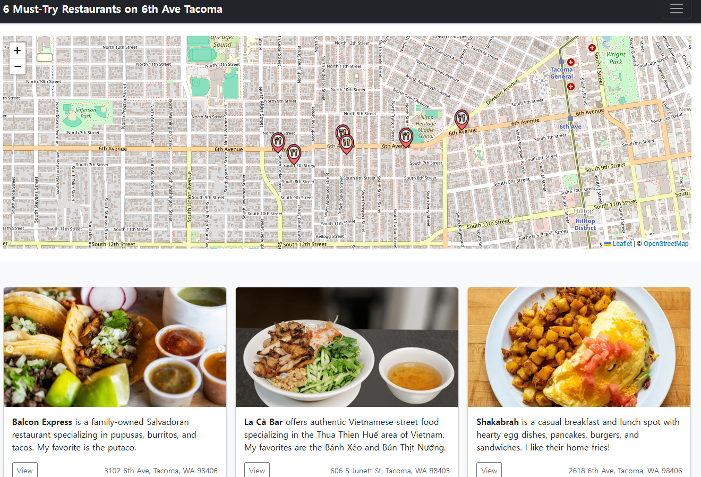
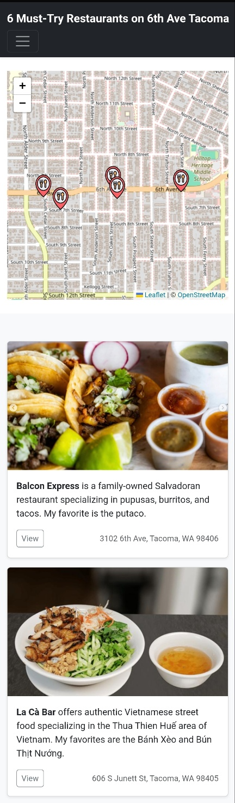

# 6 Must-Try Restaurants on 6th Ave Tacoma 🍜

A responsive, interactive restaurant listing web app showcasing top local dining spots along Tacoma's iconic 6th Avenue. This project demonstrates my ability to combine geolocation, UI design, and responsive layout using modern web technologies.

[🔗 Live Demo](https://uj-k.github.io/6-Must-Try-Restaurants-on-6th-Ave-Tacoma/)

---

## 🔍 Features

- 📍 **Interactive Map**: View all restaurants on a Leaflet-based map
- 🖼️ **Photo Cards**: Clean, visual presentation for each restaurant
- 📱 **Responsive Design**: Looks great on desktop and mobile
- ✨ **Custom Icons**: Used [nawicon](https://www.flaticon.com/free-icons/restauran) for stylistic consistency
- 🧠 Built with usability and local community discovery in mind

---

## 💻 Tech Stack

| Technology | Role |
|------------|------|
| [HTML5](https://developer.mozilla.org/en-US/docs/Web/Guide/HTML/HTML5) | Page structure |
| [CSS3](https://developer.mozilla.org/en-US/docs/Web/CSS) + [Bootstrap](https://getbootstrap.com/) | Styling and responsive layout |
| [JavaScript (Vanilla)](https://developer.mozilla.org/en-US/docs/Web/JavaScript) | Interactive behaviors |
| [Leaflet.js](https://leafletjs.com/) | Map rendering and marker interaction |
| [nawicon (Flaticon)](https://www.flaticon.com/free-icons/restauran) | UI iconography |
| [GitHub Pages](https://pages.github.com/) | Hosting and deployment |

---

## 📸 Screenshots

| Web View (Desktop) | Mobile View |
|--------------------|-------------|
|  |  |

---

## ✨ What I Learned

- How to build a fully responsive static website from scratch
- How to integrate third-party libraries (e.g., Leaflet, Bootstrap)
- How to structure visual content for readability and engagement
- Publishing static projects on GitHub Pages

---

## 🙋‍♀️ About Me

Hi, I'm Uju Krallum — a soon-to-be graduate of Clover Park Technical College's Computer Programming program.  
I enjoy building practical, accessible tools that blend community, culture, and technology.

> ✨ This project is part of my web portfolio that connects real-world utility with responsive, modern design.

📧 Contact: [Email](umkrall@gmail.com) / [LinkedIn](https://www.linkedin.com/in/uju-krallum-j27)

